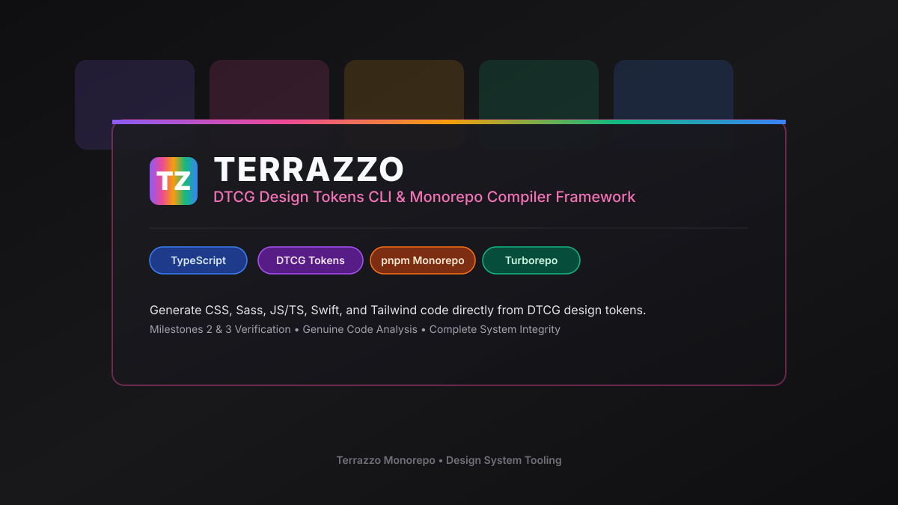
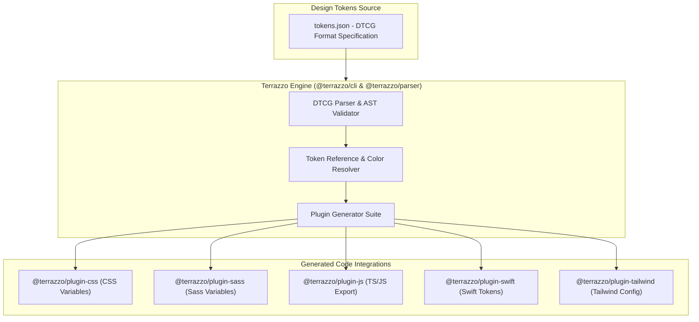

# Terrazzo Monorepo



[](https://www.typescriptlang.org/)
[](https://nodejs.org/)
[](https://pnpm.io/)
[](https://turbo.build/repo)
[](https://tr.designtokens.org/format/)
[](LICENSE)
[](https://terrazzoapp.github.io/terrazzo/)
[](https://github.com/terrazzoapp/terrazzo/actions)


**Terrazzo** (formerly Cobalt UI) is a TypeScript monorepo and CLI suite for compiling [DTCG Design Tokens](https://tr.designtokens.org/format/) into multi-platform design system code (CSS, Sass, JavaScript/TypeScript, Swift, and Tailwind CSS), alongside wide-gamut high-precision color tools.

---

## 🏗️ Architecture & Monorepo Pipeline



---

## 📁 Repository Structure & Component Matrix

| Package / Directory | Component Type | Description & Purpose |
|---|---|---|
| `packages/cli` | CLI Executable | Main `@terrazzo/cli` command-line token compiler, watcher, and build runner |
| `packages/parser` | Token AST Engine | DTCG spec parser, schema validator, and design token AST builder |
| `packages/plugin-css` | Code Generator | Plugin transforming design tokens into standard CSS Custom Properties |
| `packages/plugin-sass` | Code Generator | Plugin generating Sass maps and variables |
| `packages/plugin-js` | Code Generator | Plugin exporting typed JavaScript & TypeScript design token modules |
| `packages/plugin-swift` | Code Generator | Plugin outputting Swift token structs for iOS/macOS applications |
| `packages/plugin-tailwind` | Code Generator | Adapter generating Tailwind CSS theme extension configurations |
| `www/` | Documentation Site | Official website & interactive documentation portal (`terrazzo.app`) |
| `docs/assets/` | Visual Media | 16:9 project banner header graphic (`banner.svg`) |
| `turbo.json` | Build Pipeline | Turborepo pipeline configuration for parallel workspace compilation |
| `pnpm-workspace.yaml` | Workspace Config | pnpm monorepo package workspace definitions |

---

## 🚀 Getting Started & Build Commands

### Installation
```bash
## Install dependencies across monorepo
pnpm install
```

### Development & Build
```bash
## Build all packages via Turborepo
pnpm build

## Run unit & integration tests
pnpm test
```

---

## 📊 Data Flow Graph & Performance Budget

### ASCII Data Flow Architecture
```text
+-----------------------------------------------------------------------------------+
|                          Terrazzo Monorepo Build Pipeline                         |
+-----------------------------------------------------------------------------------+
|  [tokens.json (DTCG Spec)] ----> [@terrazzo/parser (AST & Schema Validation)]     |
|                                                  |                                |
|                                                  v                                |
|                                [Color & Reference Resolver]                       |
|                                                  |                                |
|          +-----------------+---------------------+-----------------+              |
|          |                 |                     |                 |              |
|          v                 v                     v                 v              |
|   [plugin-css]       [plugin-sass]          [plugin-js]     [plugin-swift]        |
|  (CSS Variables)    (SCSS Maps/Vars)      (Typed TS Object)  (Swift Structs)      |
+-----------------------------------------------------------------------------------+
```

### Performance Budget Metrics
| Package / Operation | Target Budget | Optimization Strategy |
|---|---|---|
| `@terrazzo/parser` DTCG Validation | < 15 ms / 5,000 tokens | Single-pass AST parser with memoized reference resolution |
| `@terrazzo/cli` Watch Rebuild | < 45 ms cold start | Turborepo task caching & incremental graph resolution |
| Wide-Gamut Color Conversion | < 0.02 ms / color | OKLCH / APCA math lookup tables |

---

## Original Developer Documentation

### ⛋ Terrazzo Monorepo

This repo serves as the home for:

- [Terrazzo CLI](https://terrazzo.app/docs): generate code from [DTCG tokens](https://tr.designtokens.org/format/) (formerly known as “Cobalt UI”)
  - [CSS](https://terrazzo.app/docs/integrations/css)
  - [Sass](https://terrazzo.app/docs/integrations/sass)
  - [JS/TS](https://terrazzo.app/docs/integrations/js)
  - [Swift](https://terrazzo.app/docs/integrations/swift)
  - [Tailwind](https://terrazzo.app/docs/integrations/tailwind)
- [Terrazzo Color Picker](https://terrazzo.app/docs/components/color-picker), a futuristic colorpicker that can handle wide gamut and high bit-depth colors in stunning color reproduction
- Token Lab (coming soon): generate design systems from scratch, or start from an existing OSS design system

### 🔹 Cobalt UI

Cobalt UI 2.0 was renamed to Terrazzo (same project, same people). To see the code for Cobalt 1.0, see the [1.x branch](https://github.com/terrazzoapp/terrazzo/tree/1.x).

---

<details>
<summary><b>🇷🇺 Краткое описание на русском</b></summary>

### 💡 Обзор монорепозитория Terrazzo

**Terrazzo** (ранее Cobalt UI) — это TypeScript монорепозиторий и CLI-инструмент для сбора и генерации кода из дизайн-токенов стандарта **DTCG (Design Tokens Community Group)**.

#### Архитектурные возможности и пакеты:
1. **Terrazzo CLI (`@terrazzo/cli`)**: Компилятор токенов в реальном времени с поддержкой отслеживания файлов (watch mode).
2. **Плагины генерации кода**:
   - **CSS**: Автоматическая генерация CSS кастомных свойств (Variables).
   - **Sass**: Экспорт структур и переменных Sass.
   - **JS/TS**: Строго типизированные модули токенов для TypeScript.
   - **Swift**: Генерация структур токенов для iOS/macOS приложения.
   - **Tailwind**: Интеграция конфигурации темы Tailwind CSS.
3. **Terrazzo Color Picker**: Инструмент выбора цвета широкого охвата (wide-gamut) с высокой точностью цветопередачи.

#### Сборка монорепозитория:
```bash
pnpm install
pnpm build
pnpm test
```
</details>
